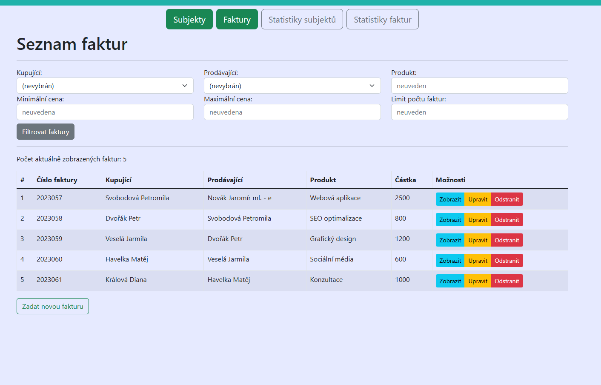
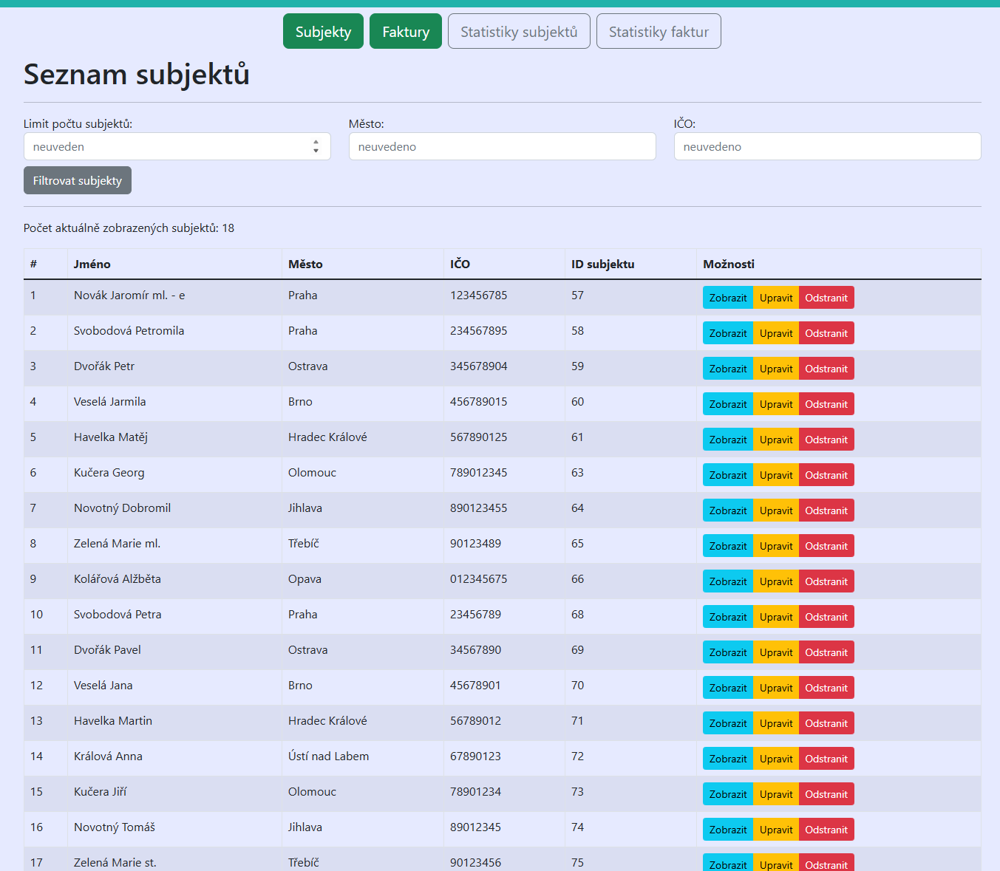
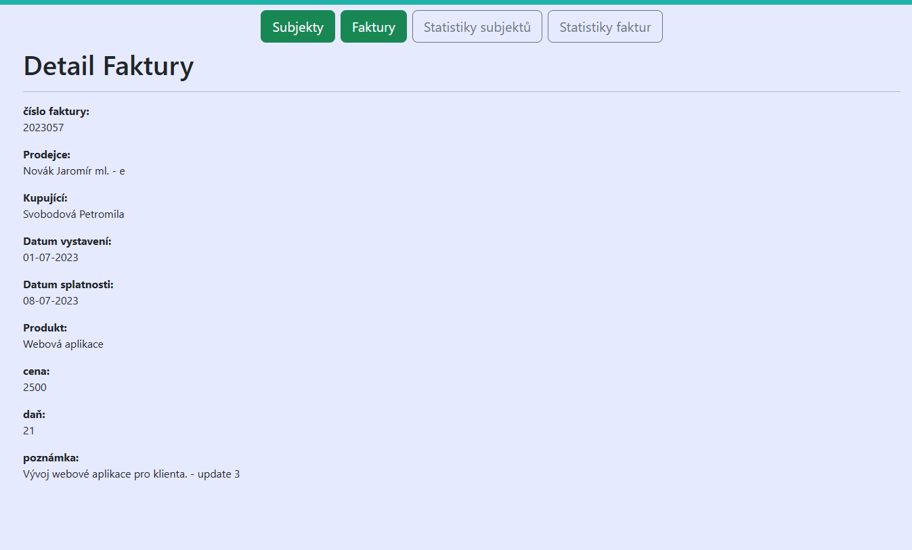
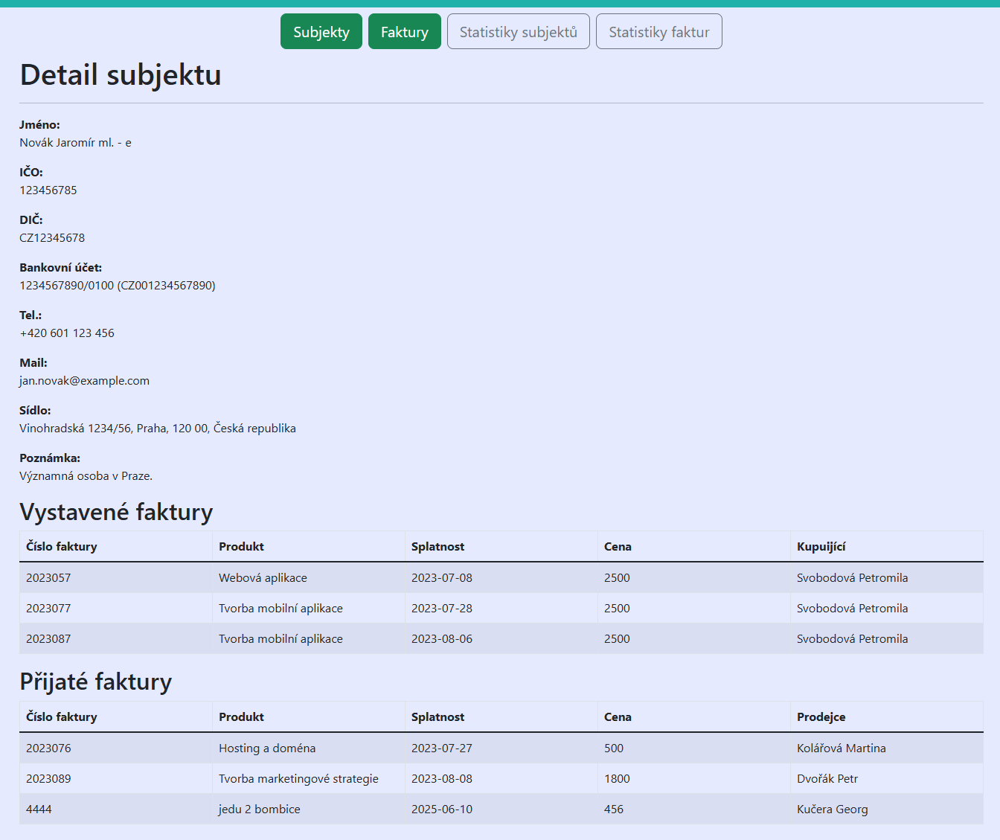

# ITNETWORK-JAVA-PRO

Tento repozitář obsahuje samostatný projekt, které byly vytvořen jako součást kurzu na [ITnetwork](https://itnetwork.cz) se specifikací Java PRO (Tvorba www aplikací). 

🔴 Licence mi bohužel neumožňuje sdílet kód ve veřejném repozitáři. 
🔴 V případě **pracovní nabídky** mohu kód poskytnout na požádání.

## 📦 Projekt je založen na:

✅ frontend: React 
✅ backend: Spring Boot

Jedná se o základní správu subjektů (prodávající, kupující) a vystavených (přijatých) faktur. 
Projekt byl tvořen samostatně a za pomocí konzultací s vyučujícími. 
Základní kostra projektu byla poskytnuta ITnetwork. 

